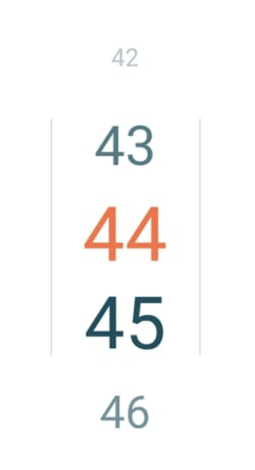

# Vertical slider picker for ionic angular

## Options

- `startValue` : Valeur de départ
- `endValue` : Valeur de fin
- `offsetValue` : Scroll initial
- `dataOverwrite` : Tableau de valeur ( any[] )
- `mainColor` : Couleur du texte
- `selctedColor = 'white'` : Default = primary

## Preview

